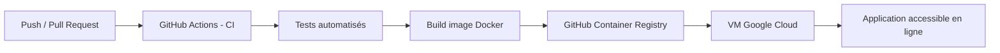

# TP CI/CD – RealWorld Node.js API

---

## Présentation du projet

Ce projet a été réalisé dans le cadre du **TP CI/CD DevOps**.  
L’objectif est de concevoir, implémenter et documenter une **pipeline CI/CD complète**, automatisée et sécurisée pour une application web.

L’application utilisée est basée sur le projet open-source **RealWorld – Node.js / Express**, une API REST représentative d’un environnement de production réel.

Le projet est **déployé exclusivement sur Google Cloud Platform (GCP)** et accessible publiquement.

---

## Accès à l’application

**Lien public pour accéder à l’application :**  
**http://35.241.185.143:3000/**

---

## Objectifs pédagogiques

- Comprendre les principes CI/CD et DevOps
- Mettre en place une pipeline automatisée
- Automatiser :
  - les tests
  - le build
  - la génération d’artefacts
  - le déploiement
- Utiliser Docker et GitHub Actions
- Déployer une application sur le cloud (Google Cloud)
- Gérer les secrets de manière sécurisée
- Documenter l’architecture CI/CD

---

## Technologies utilisées

- **Node.js / Express**
- **Nx**
- **Prisma**
- **PostgreSQL**
- **Docker**
- **GitHub Actions**
- **GitHub Container Registry (GHCR)**
- **Google Cloud Platform (VM Compute Engine)**

---

## Structure du dépôt

```text
les-petits-foufou-tp-ci-cd/
│
├── app/                          # Code source de l'application
│   ├── src/
│   ├── prisma/
│   ├── tests/
│   └── package.json
│
├── docker/
│   ├── Dockerfile
│   └── docker-compose.yml
│
├── .github/
│   └── workflows/
│       └── ci-cd.yml             # Pipeline CI/CD GitHub Actions
│
├── .dockerignore
├── .eslintrc.json
├── .prettierrc
├── SECURITY.md
└── README.md
```

## Architecture CI/CD



## Déclenchement de la pipeline

La pipeline CI/CD est automatiquement déclenchée lors de :

- `push` sur la branche **main**
- `pull_request` vers la branche **main**

---

## CI – Continuous Integration

### 1️-Installation des dépendances

- Installation des dépendances **Node.js**
- Préparation de l’environnement de build

### 2️-Tests automatisés

- Exécution des tests unitaires
- Échec automatique de la pipeline si un test échoue

### 3️-Qualité de code

- Vérification **ESLint**
- Respect des conventions de développement

---

## Build & Artifacts

### Construction de l’image Docker

- Build de l’image Docker à partir du `Dockerfile`
- Tags appliqués :
  - `latest`
  - SHA du commit

**Exemple :**
```bash
ghcr.io/les-petits-foufou/tp-ci-cd:latest
```

# Registry

Les images Docker sont stockées sur **GitHub Container Registry (GHCR)**.

---

## CD – Continuous Deployment

### Environnement de déploiement
- **Plateforme :** Google Cloud Platform  
- **VM :** Compute Engine  
- **Déploiement :** via Docker  

### Stratégie de déploiement
**Recreate**  
1. Arrêt du conteneur existant sur la VM  
2. Pull de la nouvelle image Docker  
3. Redémarrage du conteneur  

---

## Sécurité & gestion des secrets

- Aucun secret stocké dans le dépôt Git  
- Utilisation des **GitHub Secrets**  
- Accès sécurisé à la VM Google Cloud  

### Secrets utilisés
- `DATABASE_URL`  
- `JWT_SECRET`  
- `GHCR_TOKEN`  

### Secrets d’accès à la VM Google Cloud
- Détails disponibles dans `SECURITY.md`  

---

## Déploiement et accès

Le déploiement est entièrement automatisé via la pipeline CI/CD :  
1. Tests  
2. Build de l’image Docker  
3. Push vers GHCR  
4. Déploiement automatique sur Google Cloud  

**Application accessible à l’adresse suivante :**  
[http://35.241.185.143:3000/](http://35.241.185.143:3000/)
